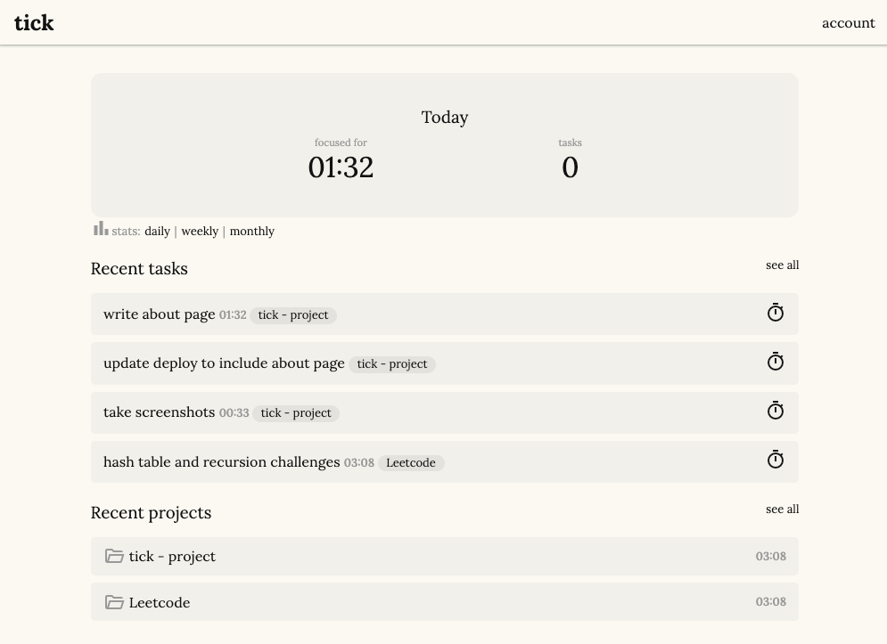
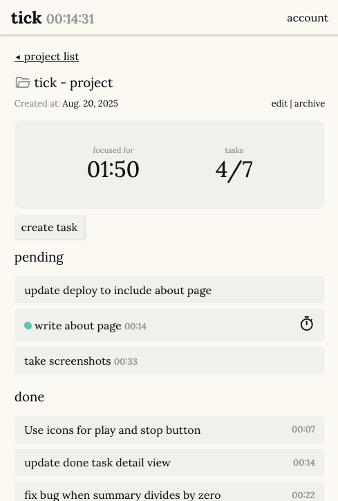

# Tick
Tick is a simple, focused time-tracking app designed to help you see where your time goes. Organize your work into projects and tasks, track sessions with a one-click timer, and review your progress with clean daily, weekly, and monthly summaries.

**Live Demo:** [Tick on PythonAnywhere](https://juliavillela.pythonanywhere.com/)

This is a portfolio project built with Django (backend) and simple templates (frontend).

## Features
- One-click time tracking — start/stop timers for any task.
- Automatic session logging — no manual entry required (but sessions can be adjusted afterward).
- At-a-glance progress — always know how much time you’ve invested in each project or task.
- Project archiving — hide completed projects without losing their history.
- Daily summary — see what you worked on, how long you spent, and in what order.
- Weekly & monthly summaries — track focus time and project breakdowns over time.
- Timezone support - summaries are accurate for your local time, wherever you are.

## Tech Stack
- Python/Django - Backend logic and database operations using Django’s built-in ORM.
- SQLite — default local database
- Django templates — minimal frontend
- HTML, CSS and Javascript

## Installation and usage
```bash
git clone https://github.com/juliavillela/tick.git
cd tick
python -m venv venv
source venv/bin/activate   # On Windows use: venv\Scripts\activate
pip install -r requirements.txt
```
Run migrations and start the dev server:
```bash
cd tick_project
python manage.py migrate
python manage.py runserver
```
Visit `http://127.0.0.1:8000/` to start using Tick.

## Screenshots

